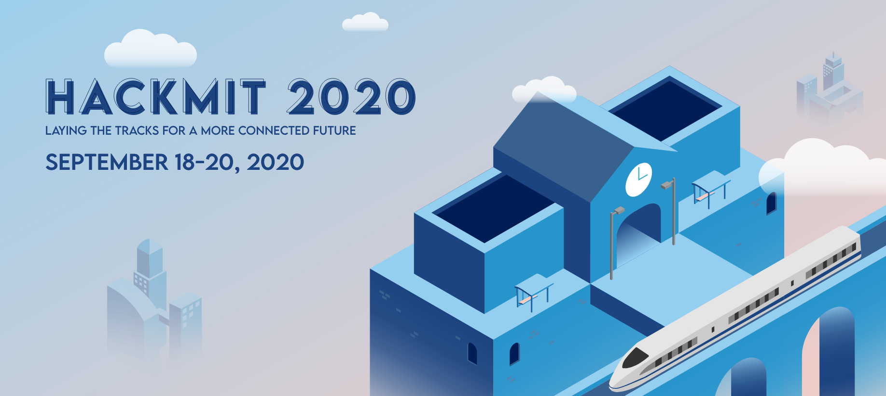

# HackMIT-2020

## Register For IBM Cloud to get Started

Get started with the IBM Chalenge by registering for IBM Cloud at: <https://ibm.biz/HackMIT2020>

## Main Challenge Prizes

* 1st Place - $1500
* 2nd Place - $750
* 3rd Place - $500 
* Green Compute Challenge - $500

> All prizes will be split among all team members 

## Main Challenge - Best Solution Addressing the Community Response to Covid 19

Technology can aid how the community responds to problems caused by COVID-19 separate from government or healthcare officials. This includes how our bedrooms have become our classrooms, how we can know the information we are reading and hearing is accurate, how we can communicate in this crisis and so much more. We're looking to gauge projects outside of healthcare-related solutions that assist or resolve other obstacles presented by this pandemic. Categories for this challenge may include remote education, crisis communication, community cooperation, etc. 

**To qualify for this challenge all solutions in this category must leverage at least 1 IBM service or API**

## Green Compute Challenge 
MIT and IBM are coming together to offer the "green compute challenge" at HackMIT.From AI machine learning to large climate prediction models, high-performance computing is helping us make the world a better place. At the same time, high-performance computing is extremely energy intensive. Some predictions using current growth rates show that AI computing alone will take more than 30% of the worlds energy resources by the end of the 2030's. We can't let that happen !

MIT currently leads the word in green supercomputing with the IBM donated [MIT Satori Supercomputer](https://www.hpcwire.com/solution_content/ibm/cross-industry/mit-upgrades-ai-research-with-satori-supercomputer/) which lives in the 97% renewable energy [Mass Green High-Performance Computing Center](https://www.mghpcc.org/). A typical high performance benchmark on Satori, if run repeatedly for a year, would use about 5 maple trees worth of carbon vs. about 280 maple trees worth of carbon running in a "typical" high-end data center. That's a 60x difference ! 

The HackMIT MIT-IBM Green Compute Challenge is looking for ways to help lower the carbon footprint of all high performance computation by raising people's awareness of the carbon cost of their computing. **The winning solution will receive $500 for the project that helps make energy and/or carbon awareness easier... and more fun.. to calculate**. We have lots of ideas and input data on the energy efficiency of various computer platforms, the energy mix of data centers by geography, etc, and would love to help you formulate your solution.  

## IBM Cloud Catalog

* <https://cloud.ibm.com/catalog>

## Slack channel

* The [#ibm](https://hackmit2020.slack.com/archives/C01B3KWRJRW) channel at [hackmit2020.slack.com](https://hackmit2020.slack.com)

## Workshop 

* Sat, Sep 19, 2020 1:00 PM - 2:15 PM (EST)
* <https://github.com/Call-for-Code/Solution-Starter-Kit-Communication-2020>

## Inspiration

* Call for Code Open Source Project - https://developer.ibm.com/callforcode/projects/
* Developer Library - https://developer.ibm.com/callforcode/technical-library/ 
* Crisis Communication Starter Kit - https://developer.ibm.com/callforcode/get-started/covid-19/crisis-communication/
* Remote Education Starter Kit - https://developer.ibm.com/callforcode/get-started/covid-19/remote-education/ 
* Community Cooperation Starter Kit - https://developer.ibm.com/callforcode/get-started/covid-19/community-cooperation/

## Code Patterns

Find all your code patterns at:  https://developer.ibm.com/patterns/ or check out this [curated list](https://github.com/IBM/HackMIT-2020/blob/master/Codepatterns.md)

## More Info

* Call For Code - https://developer.ibm.com/callforcode/
* Call For Code Repos - https://github.com/Call-for-Code 
* Code and Response - https://developer.ibm.com/code-and-response/
